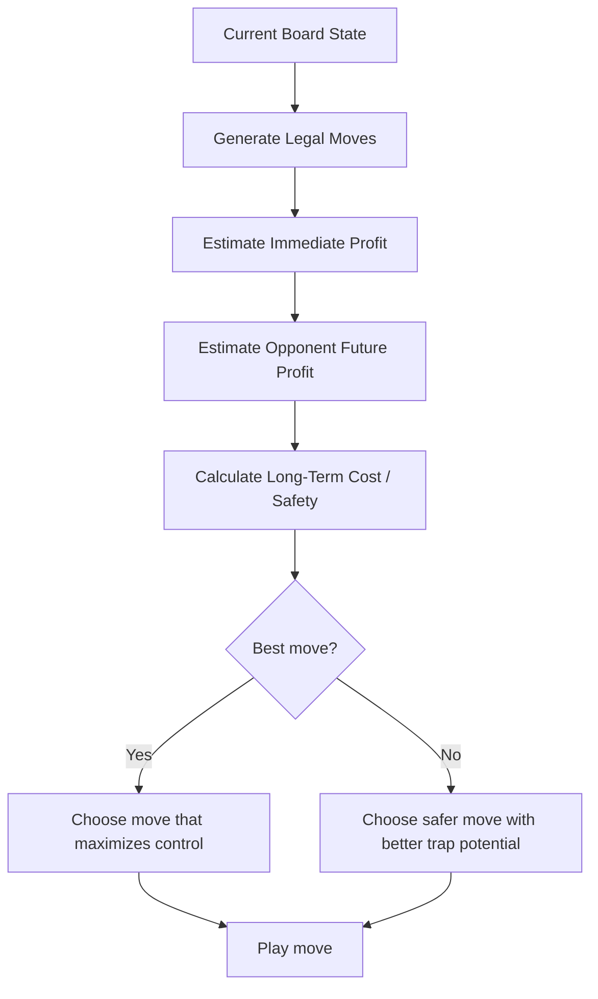

# Dot & Box AI Game

<p align="center">
  
  
  
</p>

A browser-based Dot & Box game with a fast AI opponent that uses a greedy, profit-aware strategy instead of a full minimax search.

> This bot is designed to play smart, not brute-force. It looks for profitable moves, evaluates the opponent's future opportunities, and sometimes gives up a small immediate gain to build a stronger trap.

---

## 🎮 Game Overview

- Players draw horizontal or vertical lines between dots.
- Completing a box earns a point.
- The player with more boxes at the end wins.
- The game runs in the browser with plain JavaScript.

### Core Idea

```text
Player move -> check immediate box profit -> estimate opponent reaction -> choose best long-term move
```

The AI does not deeply search every branch of the game tree like minimax would. Instead, it uses a fast heuristic that is much quicker and still strong enough to make good decisions.

---

## 🧠 AI Strategy

### 1. Greedy Profit-Based Decision Making

The bot evaluates every legal move and measures:

- how many boxes that move completes immediately,
- how much the move helps or hurts the opponent next,
- and whether the move creates a better future board state.

So the bot is not just taking the easiest box. It is choosing the move that gives the best overall position.

### 2. Small Sacrifice for Bigger Long-Term Gain

This is the heart of the strategy.

Sometimes a move gives less immediate score, but it prevents the opponent from building a strong advantage later.

```text
Immediate gain: 1 box
Long-term gain: trap the opponent and deny future boxes
```

This is why the AI can play better than a simple greedy bot that only grabs every available box.

### 3. Double-Cross Style Tactics

The bot uses a double-cross approach:

- it can make a move that looks harmless at first,
- then use that move to limit the opponent's future options,
- and push the opponent into a bad position where they get stuck.

This means the opponent often loses control of the board and cannot recover easily.

```text
Normal greedy bot: only cares about immediate boxes
This AI: cares about boxes + opponent trap + future control
```

---

## 🔄 Strategy Flow



This diagram shows the decision-making process used by the robot.

---

## ⚙️ Why the AI Is Fast

This implementation avoids full minimax search, which can become very expensive in Dot & Box because the number of possible states grows quickly.

### Instead, it uses a lightweight heuristic:

- checks only legal moves,
- computes immediate box gain,
- estimates opponent response,
- and picks the strongest move with low overhead.

### Benefits

- fast enough for browser play,
- responsive gameplay,
- better than simple naive AI,
- and much cheaper than full game-tree search.

---

## 🏆 Why the AI Is Strong

The bot balances three important things:

1. Immediate box gain
2. Opponent risk reduction
3. Long-term positional control

This makes it stronger than a basic greedy player because it is not only chasing points. It is also trying to control the game flow and trap the opponent.

### In short

- It captures boxes when safe.
- It avoids feeding the opponent easy wins.
- It creates pressure and forced positions.
- It can make the opponent get stuck and remain unable to win cleanly.

---

## 📁 Project Files

- `index.html` – main game page
- `style.css` – board and UI styling
- `script.js` – game logic and rendering
- `robot.js` – robot logic
- `robot_v1.js` – main AI strategy implementation

---

## 🌐 Live Demo

The game is deployed on GitHub Pages here:

https://rahulkumar111232192-ux.github.io/Dot-box-AI-Playing-game/

---

## ▶️ How to Run

Open the project in a browser using a local server.

### Example

```bash
cd "d:\projects\dot&box"
python -m http.server 8000
```

Then visit:

```text
http://localhost:8000/
```

---

## 🧾 Summary

This Dot & Box game uses a fast greedy AI strategy rather than full minimax. That gives it a strong practical advantage:

- it responds quickly,
- it makes smarter long-term choices,
- and it can use double-cross tactics to slow down or trap the opponent.

In short, this AI is built to be a smart tactical player, not just a box collector.

---

## 💡 Quick Takeaway

```text
Greedy + opponent-aware cost evaluation + trap-building logic
=
Fast AI that can outplay weaker opponents and pressure them into bad positions
```
